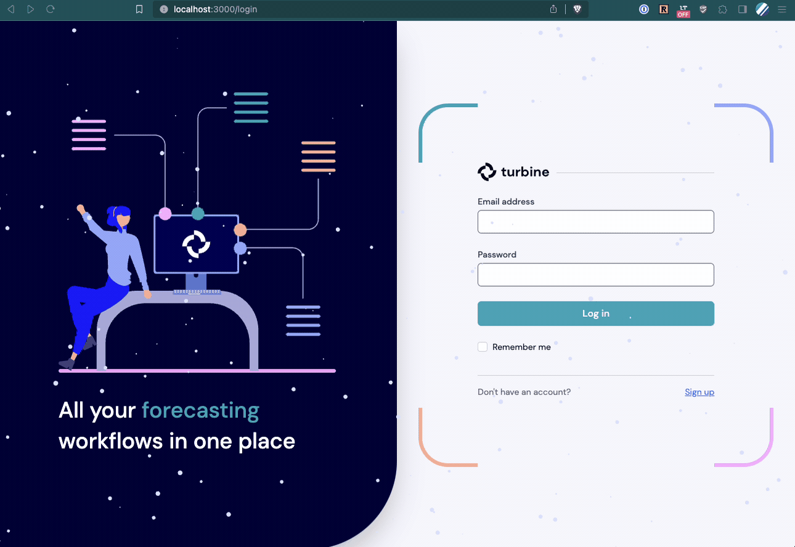

# 2023-12-21

## Happy Holidays!

Turbine will reflect the holiday spirit through January! 

## Quality of life improvements

* You can now communicate with support through the app chat bubble directly!
* Our Bang Search has been extended to now support searching for orders.
* We have polished our new homepage even further with shiny, updated icons. 
* Vendors can now be archived on the Vendor details page.
* Components can now be archived on the Component details page.
* We can now change how channel names are presented in the app. If you have a "Shopify" channel that you want to call "Pretty Unicorn" Channel, we can make that happen. Contact your account manager directly.

## Work orders

* Work order numbers are now human readable.
* You can now select vendors to send your work orders to directly in Turbine. Only vendors who are manufacturers will be available for selection. 
* Work orders can be scheduled for emailing, just like Purchase Orders. 

## Purchase orders

* Bug fix: You can now add freight shipments to POs, independent of how the PO was created!
* We now show the Vendor SKU when creating a PO instead of the SKU ID.
* In the case of multiple Vendor SKUs on the same Vendor, we will now use the most recently updated on PO creation to suggest price.

## Nodes

* We have a shiny, new Node Details page!
* You can now archive nodes directly from the node details page.

## Other Improvements and Bug squashing
* Fixed a bug that sometimes led to payments being processed out of order. 
* Your account admin can help your merge SKUs. Please contact your account manager directly for support.

