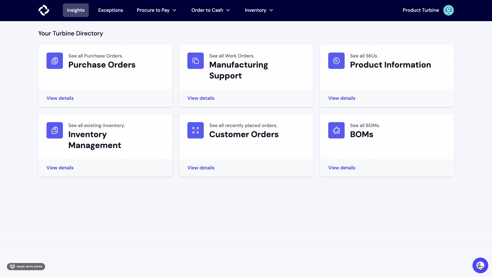

# Administration

Welcome to Turbine! This tutorial will guide you through the initial steps to get started. 
Throughout this process, you will:

* Log in to Turbine.
* Reset your password.
* Make use of in-app support features.
* Connect with support through alternative methods.
* Learn how to switch between tenants on Turbine.

## Logging in

Upon an account being created, you will receive an email with an invite link. You have 72 hours to create your account before the invite link expires. The link can only be used once and it must match the email address it was created for. 

## Resetting your password

After having your password reset, you will receive an email with a reset link. You have 4 hours to reset your password befor ethe link expires. The link can only be used once and it must match the email address it was created for. 

## Getting Help

Support is generally available from 8 AM to 8 PM ET on Mondays-Thursdays and 8 AM to 4 PM on Fridays, except on major US Holidays

### In-app Support

We have an in-app chat that allows you to easily reach out to us for assistance, share valuable product feedback, or quickly access important links, all within the chat window. We're here to provide dedicated customer support and enhance your overall experience. 

### Email Support

Please email support@helloturbine.com for support.

### Slack Support

You can also get support via the Shared Slack channel that you are invited to as part of onboarding. Please contact your Account Manager with questions.

## How to switch tenants on Turbine

1. The tenant currently active will be mentioned on the top right side of your screen (e.g., "Product Turbine"). 

2. Select the round profile button. 
3. From the dropdown menu that appears, select the tenant you wish to switch to.
