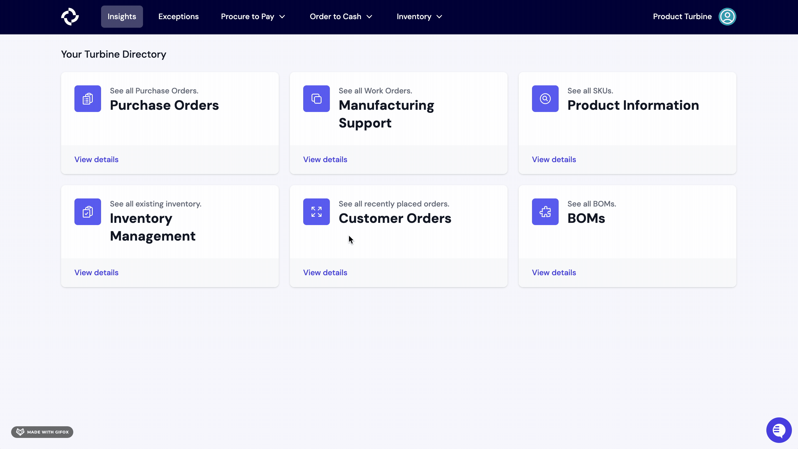

# Command Palette

Turbine has a command palette that can be brought up with the CMD+K or CTRL+K shortcut. 

## Navigation

The Command Palette can be used to navigate to any page in the app just by typing the name of the page. Some examples are below.

| Command Palette      | Searches             |
|----------------------|----------------------|
| !Purch...            | Purchase Orders      |
| !Work                | Work Orders          |
| !Outbound            | Outbound Orders      |
| !New Purchase Order  | New Purchase Order   |
| !New Work Order      | New Work Order       |
| !Repor..             | Report               |
| !Inven               | Inventory Transfers  |

## Search

The Command Palette also supports search across specific items using a "bang" shortcut. For example `!v` will search for vendors and `!s` will search across SKUs. 

The list of bang shortcuts that are supported are:

| Bang shortcut        | Searches             |
|----------------------|----------------------|
| !c                   | Components           |
| !s                   | SKUs                 |
| !po                  | Purchase Orders      |
| !v                   | Vendors              |
| !r                   | Receipts             |
| !fs                  | Freight Shipments    |
| !o                   | Outbound Orders      |

