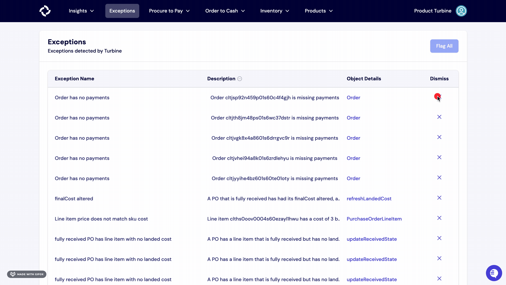

# Exceptions

Exceptions are issues that Turbine thinks are worth further attention. Exceptions can be operational (a late order that hasn't shipped), financial (an invoice that doesn't match what was ordered), or data-related (a SKU that doesn't exist in Turbine yet).

## How to dismiss exceptions in Turbine

1. Navigate to the [Exceptions](https://app.helloturbine.com/app/exceptions) page.
2. Select the X button under the column "Dismiss".
3. Choose "resolve" or "dismiss" from the drop-down menu.
4. Write a note (if any) and hit the "dismiss" button.

