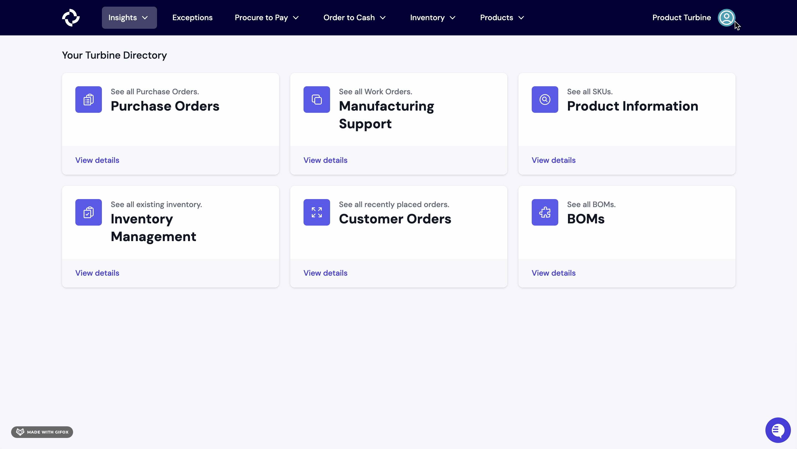
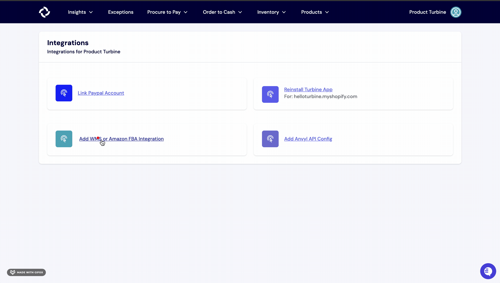

# WMS

Our WMS integration allows you to continue receiving daily inventory updates, streamline receipt creation, and track fulfillment information on Turbine. 

## Steps
1. In Turbine, navigate to the [Integrations page](https://app.helloturbine.com/integrations). Alternatively, you can bang search by typing CMD+K or CTRL+K and type "Integrations".

2. Scroll to the bottom of the page and click the "Add WMS or Amazon FBA Integration" button.

4. Hit the "Continue" button and select your WMS. 

## List of WMS integrations

Today, here are some of the systems that we integrate with. This list is regularly growing and changing. Please consult with your Account Manager directly with any questions. 

* Amazon FBA
* BlueBox (IDrive Fulfillment)
* Camelot
* DCL
* Dear Systems (Cin7 Core)
* Deposco
* Extensiv (3PL Central)
* Flexport (Deliverr)
* Infoplus
* Logiwa
* MasonHub
* Ongoing WMS
* ShipBob
* Shipfusion
* ShipHero
* ShipMonk
* ShipStream
* Shipwire
* SKUSavvy
* SkuVault
* Smart Warehousing
* Stord
* Veracore
* Whiplash (Ryder)
