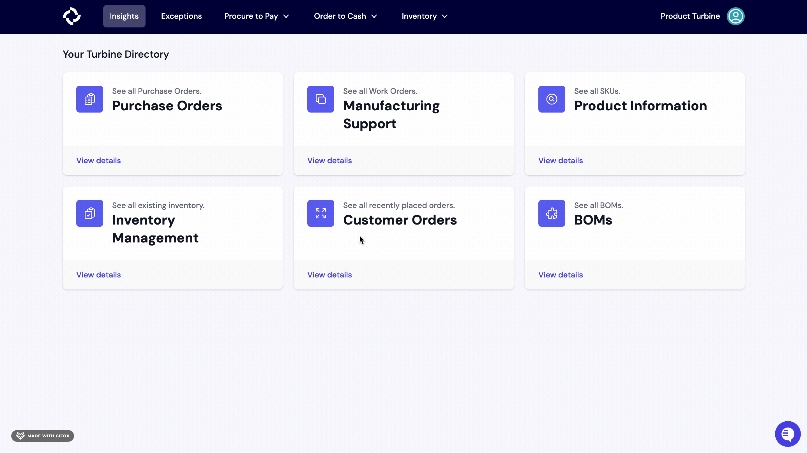

# WMS

Our WMS integration allows you to continue receiving daily inventory updates, streamline receipt creation, and track fulfillment information on Turbine. 

## Steps
1. In Turbine, navigate to the [Settings page](https://app.helloturbine.com/settings). Alternatively, you can bang search by typing CMD+K or CTRL+K and type "Settings".

2. Scroll to the bottom of the page and click the "Add Trackstar Integration" button.

4. Hit the "Continue" button and select your WMS. 
