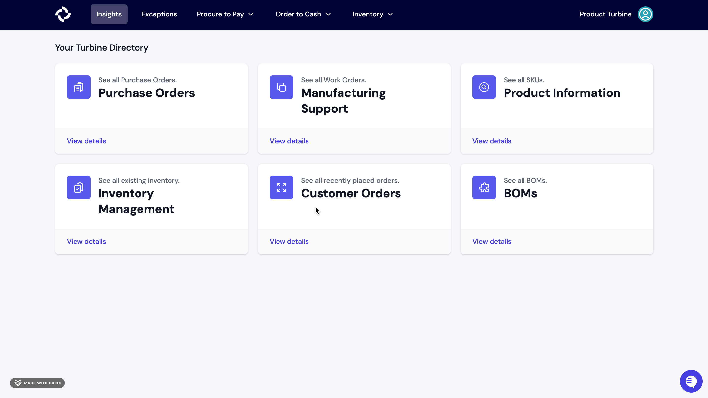
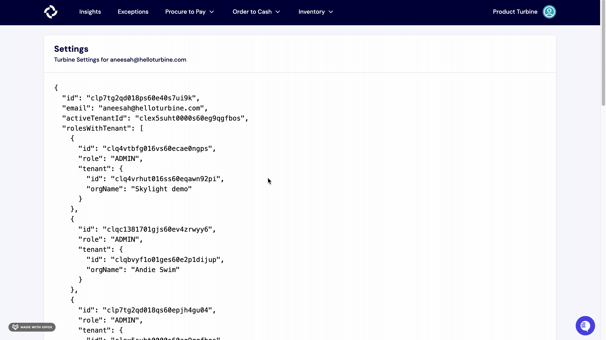

# Anvyl

Our Anvyl integration allows you to continue to use Anvyl for purchase order tracking, but see the data in Turbine. 

## Install

### Requirements 

- To get set up, you will need to [generate an API key](https://support.anvyl.com/hc/en-us/articles/14627347875085-Generate-an-API-key).
- Please share the API Key with us using a secure service like [One Time Secret](https://onetimesecret.com). 

### Steps

1. In Turbine, navigate to the [Integrations page](https://app.helloturbine.com/integrations). Alternatively, you can bang search by typing CMD+K or CTRL+K and type "Integrations".

2. Select the "Add Anvyl API Config" button.

4. Fill out the Team ID and API Key and hit the "Add" button

Turbine will gather all historical information on purchase orders and vendors and capture POs going forward. Note that draft POs will appear in Turbine. Cancelled and Rejected POs will surface an exception that can be resolved.

Purchase Orders cut in Turbine will not be synced to Anvyl.
