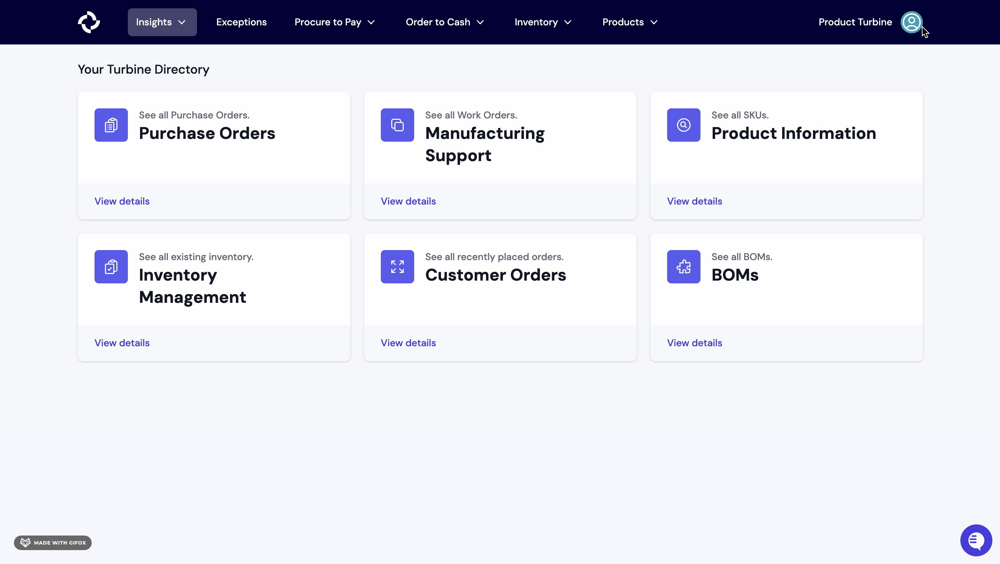

# Shopify

Our Shopify integration allows you to pull in orders, products, payments, and payouts directly from your Shopify store.

## Install

### Requirements
- You must have a [Staff account](https://help.shopify.com/en/manual/your-account/staff-accounts/create-staff-accounts) on your Shopify store
- Your Shopify staff account must have ["Manage and install apps and channels" permissions](https://help.shopify.com/en/manual/your-account/staff-accounts/staff-permissions/staff-permissions-descriptions#apps-and-channels-permissions)

### Steps
1. In Turbine, navigate to the [Integrations page](https://app.helloturbine.com/app/integrations). Alternatively, you can bang search by typing CMD+K or CTRL+K and type "Integrations".

2. Select the "Install Turbine App" link, which will take you to Shopify

3. Click the green "Install app" button

If successful, you should be redirected to Turbine and see a message that says:
> App installed, webhooks provisioned, and Turbine is ready to go!

