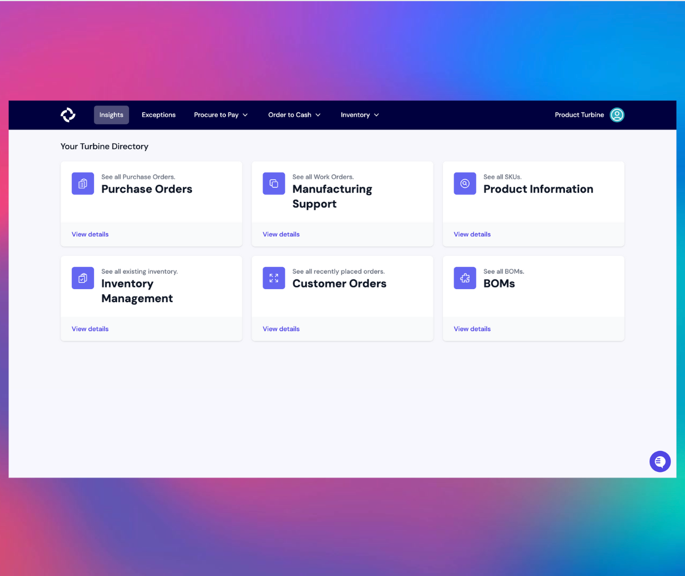
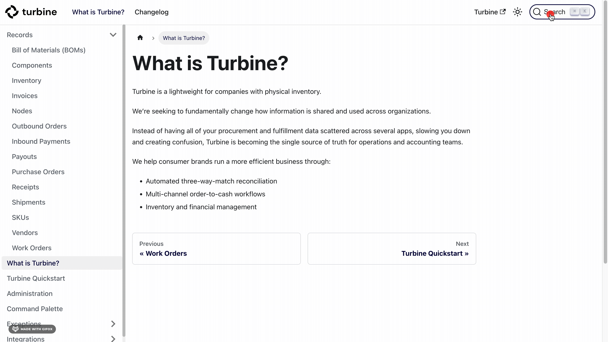

# Turbine Quickstart

Welcome to Turbine. You can use this tutorial to walk yourself through getting started. In this process, you will:
* Search on the docs site 
* Create a new SKU in Turbine
* Create a new Vendor in Turbine
* Add your SKU to the Vendor
* Cut a Purchase Order in Turbine
* Check Inventory for a SKU
* Add freight shipments to a Purchase Order in Turbine
* Create a receipt for a Purchase Order in Turbine

## How to Search on the docs site 

* Go to the [docs](https://docs.helloturbine.com/) site.
* Hit the maginify icon on the top right-side of your screen and type what you're looking for.
* Alternatively, you can type Ctrl+k on a mac or Cmd+ k on a PC and type what you're looking for.

## Creating a new SKU in Turbine

* Go to inventory and select “SKUs”.
* Select New Sku.
* Add SKU title, SKU, and final price of the SKU, and create SKU.
* If available, you can add other info such as barcode value.

## Creating a new vendor in Turbine

* Ctrl+k or Cmd+ k and type “Vendors” to go to the Vendors page or go to procure to pay and select “Vendors”.
* Select New Vendor.
* Add name of vendor, legal name of vendor (if different from name of vendor), and default incoterm if any, and create vendor.
* Fill out all available contact details and click “Update Vendor”.
* In the “Add Vendor SKU” section link the SKU/s of the vendor by adding it. 
* In Vendor SKU add what the vendor calls the SKU such as a code. 
* Add lead time and unit cost to link SKU.

## Cutting a new Purchase Order (PO) in Turbine

* Ctrl+k or Cmd+ k and type “Purchase Order” to go to the Vendors page or go to procure to pay and select “Purchase Orders”.
* Select New PO.
* Add Vendor, Requested Ready Date, and PO Number. 
* Add SKU or Component. Include Price, Quantity and Node and click “Add Item”.
* Select “Submit PO”.
* Click on the mail icon and Preview/Download PDF to see the PDF and double check info. 
* You can also edit a PO by clicking the "Edit Purchase Order" button.

## Checking inventory for a SKU

* Go to the [Inventory](https://app.helloturbine.com/app/inventory) Page.
* Find the SKU you are looking for and note the Incoming Inventory quantity (first column).
* When you cut a Purchase Order (PO), you'll see the Incoming Inventory quantity for the specific SKU in the PO increase by the entered quantity.

## Adding freight shipments to a PO in Turbine 

Once a PO is cut, you can add freight shipments to include carrier information.
* In the relevant PO details page, click the "Add Freight Shipment" button.
* Fill out the relevant information for carrier, cost, allocation model, and tracking number.
* Hit the "Save" button, followed by the "Finished" button.

## Creating a receipt from a PO in Turbine 

* Go to the [Purchase Orders](https://app.helloturbine.com/app/purchase-orders) Page.
* Next, select the PO you want to receive.
* Alternatively, you can bang search by typing CMD+K or CTRL+K and !po and type the PO number.
* Select the "Receive Purchase Order" button on the top right-side of your screen.
* Fill out the relevant information, including Receipt Number, Receipt Date, Lot number, and Quantity.
* Hit the "Create Receipt" button.  
