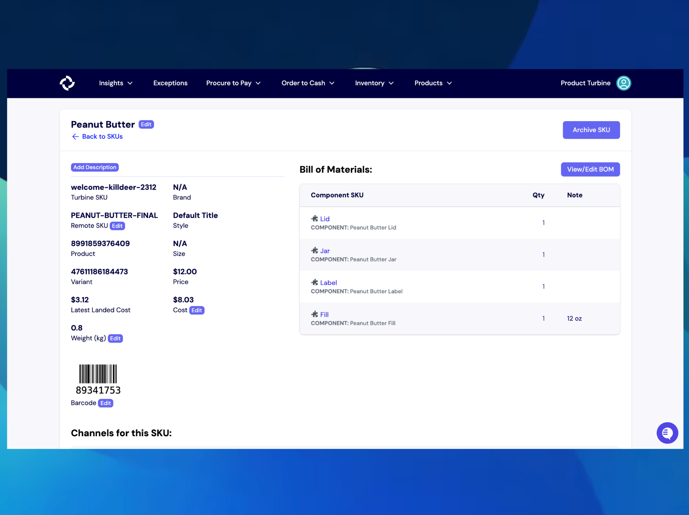

# Bill of Materials (BOMs)

A Bill of Materials, or BOM, is like a "recipe" for a product. It provides details about all the components that make up the product and how they are assembled. BOMs are essential for standardizing the production process and transforming raw materials into finished products.

Turbine supports versioning for BOMs, allowing you to schedule new BOMs or set expiration dates for special product releases.

## Create a BOM

To create a BOM, follow these steps:

1. Navigate to the "Products" tab in the navigation bar and click on "BOM."

2. Next, click the "New BOM" button located at the top right-hand side of your screen.

3. A pop-up screen will appear, prompting you to enter the Turbine SKU associated with the BOM and the validity dates. The "Valid From" field is automatically set to the current day, but it can be changed if needed. If there are no plans for the BOM to expire, leave the "Valid To" field blank.

4. Once the parent SKU and validity dates are submitted, you can look up the components, enter quantities, and add any relevant notes. If the SKU is a kitted item (composed of one or more other SKUs), you can also look up the Turbine SKUs of the constituent products.

5. As you add components and/or Turbine SKUs, they will automatically save and appear at the bottom of the screen. 

BOMs can also be cloned to facilitate the creation of similar products. To clone a BOM, click the "Clone BOM" button located at the top right-hand side of the screen.

To delete a BOM, click on it from the BOM list page, then click the "Delete BOM" button located at the top right-hand side of the screen.

## Editing a BOM

Go to the BOM details screen. Any changes you make will be auto-saved.

## BOMs Template

Sheet: https://docs.google.com/spreadsheets/d/1YakZi8V3QnjccifwHPRwfqeQ_WHrW38gwwIuY8lAJ7k/edit#gid=1587728857

Please make a copy of the above sheet before sharing BOMs mapping in Slack with your account contact.
