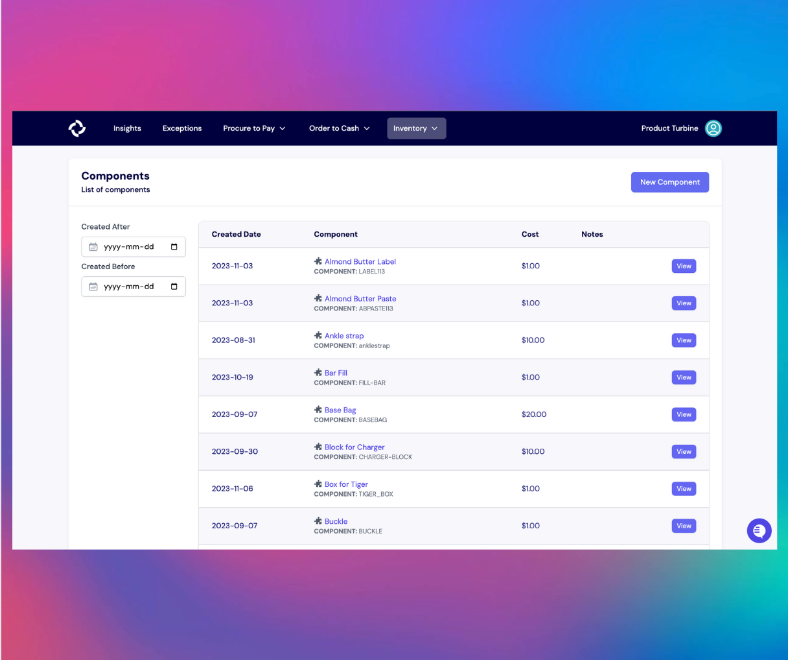

# Components

A "component" refers to an individual part, material, or sub-assembly that is used to manufacture a finished product. Each component has its unique attributes, such as part number, description, quantity, unit of measure, cost, and supplier details.

Here's a simple way to think about it:

Imagine you're making a bicycle. The [Bill of Materials, or BOM](https://docs.helloturbine.com/records/bill_of_materials) for that bicycle would list all the parts required to assemble it, including:

* The frame
* Wheels (which might be further broken down into rims, spokes, tires, and tubes)
* Brakes (which could be split into brake pads, brake levers, brake cables, etc.)
* Gears
* Handlebars
* Saddle
* Pedals
*  And so on...

Each of these parts is a "component" in the BOM. Some components can be straightforward items like screws and bolts, while others can be complex sub-assemblies with their own BOMs. For instance, the wheel, as mentioned above, can be a sub-assembly with various components making up that sub-assembly.

Managing BOMs effectively is crucial for manufacturers, as it helps them keep track of the required components, their specifications, and their sources, ensuring that the final product is made consistently and to the desired quality standards.

## Adding a Component to Turbine

From the [Components Page](https://app.helloturbine.com/app/components), in the upper right, select "New Component." 

In the "Create Component" modal, add the Name, Remote SKU, Cost, and any additional fields.

Hit "Create Component" to save changes. 

## How to archive a Component in Turbine

1. Go to the [Components](https://app.helloturbine.com/app/components) Page.
2. Next, select the Component you want to archive.
3. Alternatively, you can [bang search](https://docs.helloturbine.com/command-palette/) by typing CMD+K or CTRL+K and !c and type the Component you want to archive.
4. Hit the “Archive” button at the top right-hand side of your screen.
