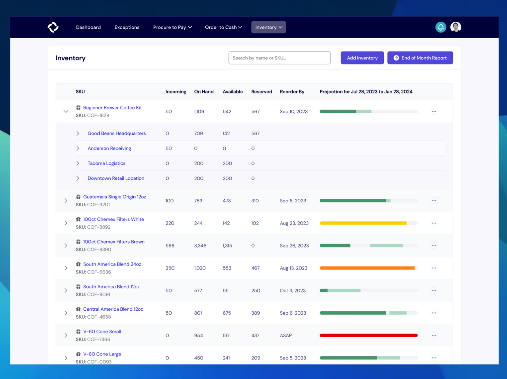
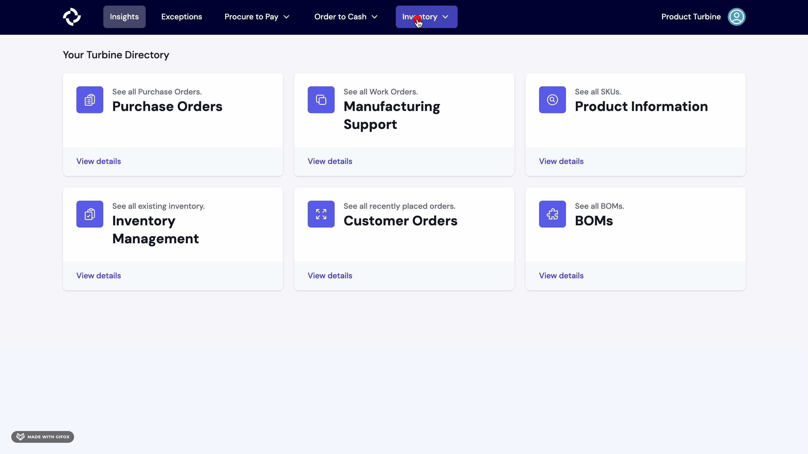
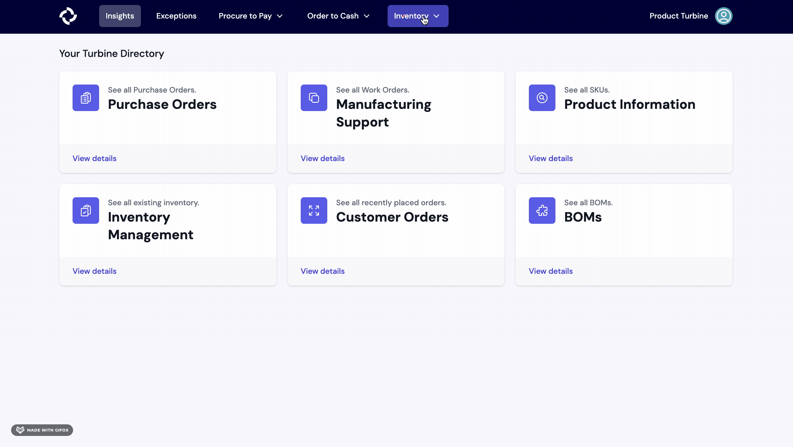

# Inventory

Inventory refers to the stock of goods and materials that a business holds for the purpose of production, resale, or use in its operations. It includes raw materials, work-in-progress items, and finished goods. Inventory is a crucial aspect of supply chain management, and effective inventory control is essential for businesses to meet customer demand, minimize carrying costs, and maximize operational efficiency.

Turbine's inventory system extends beyond tracking, incorporating robust forecasting tools, such as demand forecasting, inventory planning, and reorder actioning, ensuring businesses can optimize their stock levels and stay agile in response to market demands.

Turbine uses the below terms to track and store inventory:

* **Incoming Inventory**: This includes inventory for which a Purchase Order has been cut, but the items have not yet been received.

* **On Hand**: This denotes the number of units currently located at a specific location.

* **Available**: The count of units that are ready for sale or use in work orders.

* **Reserved**: This indicates the number of units that have been ordered but not fulfilled, consumed, or made available for sale. Additionally, reserved inventory may include items set aside for future use, such as those associated with pre-orders, even if they are not physically on hand.

*Note that we've decluttered the location dropdown on the inventory page by removing those with zero inventory across all categories*

## Inventory Forecasting

Turbine's inventory forecasting is split into multiple parts: demand forecasting, inventory planning, and reorder actioning.

### Demand Forecasting

Our demand forecasting uses your historical sales data and advanced statistical modeling to predict the number of items to be sold per week for the next 6-12 months. The forecast is created at the per-SKU-per-channel level for each week.

As we often say, you know your business better than any statistical model, so we use this as as starting point and you can always adjust appropriately.

[Sample Weekly Forecast](https://docs.google.com/spreadsheets/d/1cDtjsWS-q2akULqKEcydqpeuYSK8mvcKSLMYxBbDv6I/edit#gid=991585832)

### Inventory Planning

We take the demand forecasting to help you know when you will be in or out of inventory based on on your existing inventory on hand and already ordered inventory (projected to be on hand).

Our forecasting bar uses fully saturated color to show you when items are in stock, a lightly saturated color to show you items projected to be in stock, and a grey color for when inventory is projected to be out of stock.

### Reorder Actioning

Based on BOMs and lead times configured in Turbine, we can use the inventory plan to help you know when you need to take action. The color of our forecasting bar can help you understand how close you are to the reorder by date, where red is less than a week, yellow is less than a month, and green is some other window.

## Inventory Snapshots

Inventory Snapshots are the method that Turbine uses to track inventory. On a regular cadence, we track lot codes (if applicable) and the on hand, available, and reserved counts for each available SKU.

On the Stock page, you can find the date of the most recent inventory snapshot used for the current inventory count in the “Last Reconciled At” column.

## Inventory Snapshot Template

Sheet: https://docs.google.com/spreadsheets/d/1eJc3k63gYgawoHhi6JifLMmdt_MY2MSWWn2X5NSMsDQ/edit#gid=0

Please make a copy of the above sheet before sharing an updated inventory snapshot in Slack with your account contact.

## How to download the End of Month inventory report

1. Go to the [inventory](https://app.helloturbine.com/app/inventory) page.
2. At the top right of the screen, select the "End of Month Report" button. 
3. Hit the "Export" Button in the upper right.

This report includes the following information:
* **SKU**: A unique identifier for a specific product.
* **Product**: The name or code associated with a product.
* **Color**: The color variant of the product.
* **Category**: The classification or grouping of the product.
* **Beginning of Month Balance**: The quantity of a SKU at the start of the month.
* **Received**: The quantity of a SKU received during the month.
* **Production Job Transferred**: The quantity of a SKU used in manufacturing or transferred to production jobs during the month.
* **Sold**: The quantity of a SKU sold during the month.
* **Freebies**: The quantity of a SKU given away as freebies during the month.
* **Write Offs**: The quantity of a SKU written off or declared as losses during the month.
* **Cost of Goods Sold (COGS)**: The total cost incurred for goods sold based on FIFO methodology.
* **End of Month Inventory**: The remaining quantity of a SKU at the end of the month.

The report is produced on the second day of the calendar month for the previous month. If you need previous versions or to make changes to a previous month, please contact your account manager in Slack.

## How to download inventory from the stock screen 

1. Go to the [inventory](https://app.helloturbine.com/app/inventory) page.

2. Click on the download icon located at the top right corner of your screen, next to the "End of Month Report" button.

3. Specify the export start date and export end date, then click the "Request Download" button. You will receive an email containing a link to download your data within the next 24 hours.

## Inventory Forecasting FAQs 

### Why does my SKU not have a forecast available?

1. Minimum Order Requirement:
For a forecast to be generated, the minimum order quantity for a tenant should be greater than 10. If it is less than 10, the SKU will not be included in the forecast.

2. Minimum Order in the Past 90 Days:
A forecast is generated for a SKU if the tenant has placed at least 1 order in the past 90 days.

3. Exclusion of Weeks from Model Training:
To enhance accuracy during testing with ample data, at least 5 weeks will be excluded from the model training.

