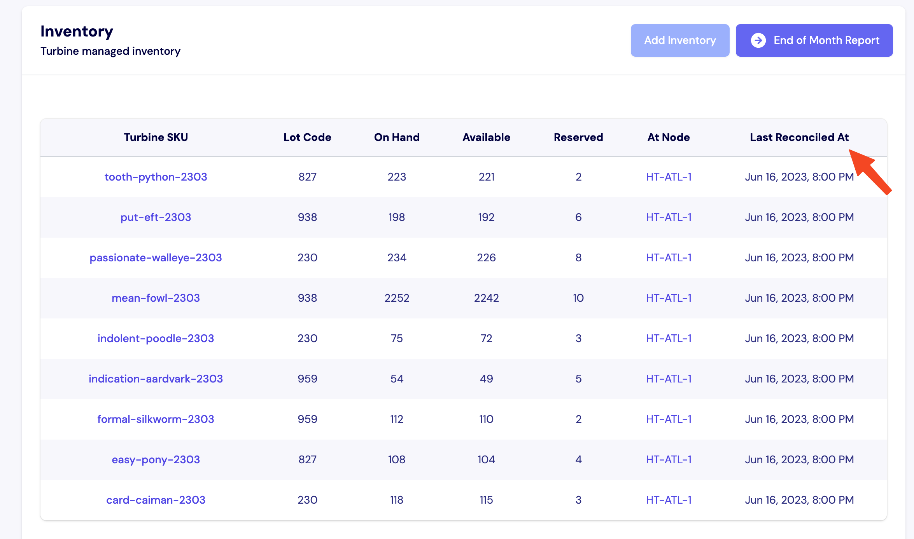

# Inventory

## Inventory Snapshots 
Inventory Snapshots are the method that Turbine uses to track inventory. On a regular cadence, we track lot codes (if applicable) and the on hand, available, and reserved counts for each available SKU. 

On the Stock page, you can find the date of the most recent inventory snapshot used for the current inventory count in the “Last Reconciled At” column.

## Inventory Snapshot Template

Sheet: https://docs.google.com/spreadsheets/d/1eJc3k63gYgawoHhi6JifLMmdt_MY2MSWWn2X5NSMsDQ/edit#gid=0

Please make a copy of the above sheet before sharing an updated inventory snapshot in Slack with your account contact. 

## Inventory Report

From the [Stock Page](https://app.helloturbine.com/app/inventory), companies can access a monthly inventory report that works for bookkeeping. This report includes information on the SKU, Category, Beginning of month balance, number of items received, number of items used in manufacturing, number of items sold, number of items written off, and the resulting end of month inventory. 

The report is produced on the first day of the calendar month for the previous month. If you need previous versions or to make changes to a previous month, please contact your account manager in Slack. 