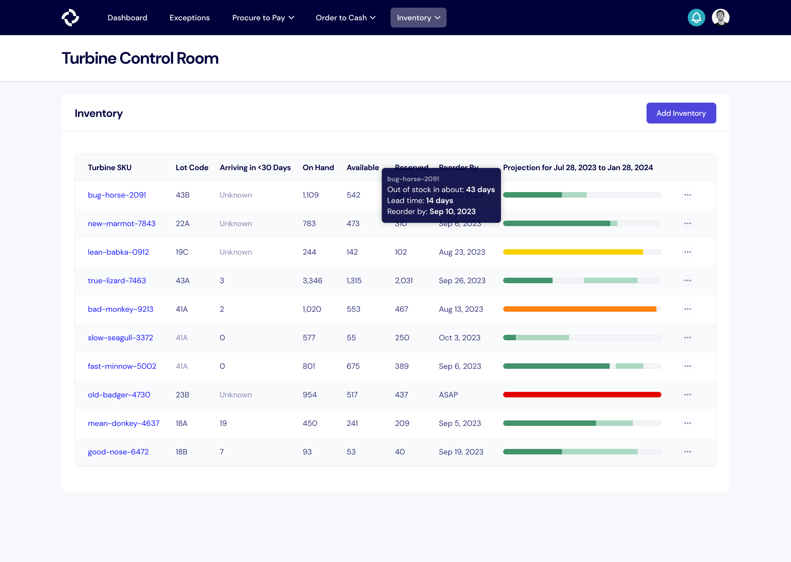

# Inventory

Inventory refers to the stock of goods and materials that a business holds for the purpose of production, resale, or use in its operations. It includes raw materials, work-in-progress items, and finished goods. Inventory is a crucial aspect of supply chain management, and effective inventory control is essential for businesses to meet customer demand, minimize carrying costs, and maximize operational efficiency.

Turbine's inventory system extends beyond tracking, incorporating robust forecasting tools, such as demand forecasting, inventory planning, and reorder actioning, ensuring businesses can optimize their stock levels and stay agile in response to market demands.

## Inventory Snapshots

Inventory Snapshots are the method that Turbine uses to track inventory. On a regular cadence, we track lot codes (if applicable) and the on hand, available, and reserved counts for each available SKU.

On the Stock page, you can find the date of the most recent inventory snapshot used for the current inventory count in the “Last Reconciled At” column.

## Inventory Snapshot Template

Sheet: https://docs.google.com/spreadsheets/d/1eJc3k63gYgawoHhi6JifLMmdt_MY2MSWWn2X5NSMsDQ/edit#gid=0

Please make a copy of the above sheet before sharing an updated inventory snapshot in Slack with your account contact.

## Inventory Report

From the [Stock Page](https://app.helloturbine.com/app/inventory), companies can access a monthly inventory report that works for bookkeeping. This report includes information on the SKU, Category, Beginning of month balance, number of items received, number of items used in manufacturing, number of items sold, number of items written off, and the resulting end of month inventory.

The report is produced on the first day of the calendar month for the previous month. If you need previous versions or to make changes to a previous month, please contact your account manager in Slack.

## Inventory Forecasting

Turbine's inventory forecasting is split into multiple parts: demand forecasting, inventory planning, and reorder actioning.

### Demand Forecasting

Our demand forecasting uses your historical sales data and advanced statistical modeling to predict the number of items to be sold per week for the next 6-12 months. The forecast is created at the per-SKU-per-channel level for each week.

As we often say, you know your business better than any statistical model, so we use this as as starting point and you can always adjust appropriately.

[Sample Weekly Forecast](https://docs.google.com/spreadsheets/d/1cDtjsWS-q2akULqKEcydqpeuYSK8mvcKSLMYxBbDv6I/edit#gid=991585832)

### Inventory Planning

We take the demand forecasting to help you know when you will be in or out of inventory based on on your existing inventory on hand and already ordered inventory (projected to be on hand).

Our forecasting bar uses fully saturated color to show you when items are in stock, a lightly saturated color to show you items projected to be in stock, and a grey color for when inventory is projected to be out of stock.

### Reorder Actioning

Based on BOMs and lead times configured in Turbine, we can use the inventory plan to help you know when you need to take action. The color of our forecasting bar can help you understand how close you are to the reorder by date, where red is less than a week, yellow is less than a month, and green is some other window.
