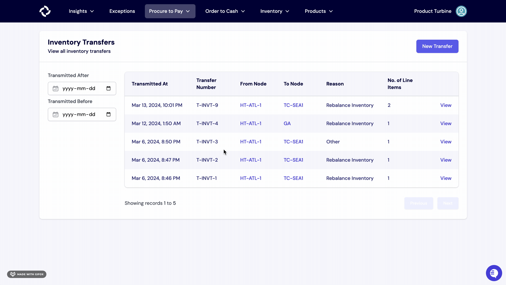

# Inventory Transfers

An inventory transfer involves the relocation of goods from one location to another, facilitating the seamless movement of inventory within a Turbine.

## How to create an inventory transfer in Turbine

1. Go to the [Inventory Transfers](https://app.helloturbine.com/app/inventory-transfers) page and select the "New Transfer" button.
2. Complete the required details, such as Transfer from Node, To Node, Transmitted on date, and optionally, Transfer Reason.
3. Specify the SKUs or components, input the Quantity, and click "Add Item."
4. Review the information for accuracy and finalize the process by clicking "Create Transfer."

Please note that for a transfer to be successfully completed, it MUST be received. Refer to the [How to Receieve an Inventory Transfer in Turbine](https://docs.helloturbine.com/records/inventory_transfers#how-to-receive-an-inventory-transfer-in-turbine) section for more info.  

## Adding new line items on an existing Inventory Transfer in Turbine

1. Select the "Add line item" button on the right of an Inventory Transfer.
2. Enter the Turbine SKU or component and Quantity and hit the "Add Transfer Item" button.

## Deleting line items on an existing Inventory Transfer in Turbine

To delete a line item in an existing Inventory Transfer, simply click the "trash" button located on the right side of the respective line item.

Please note that once an Inventory Transfer has been fully or partially received, a line item cannot be deleted. Therefore, line items can only be deleted until all items have been completely received.

## How to Receive an Inventory Transfer in Turbine

1. Navigate to the relevant Inventory Transfer by clicking on the “Procure to Pay” tab, then click on the Inventory Transfer that you would like to create a receipt for.
2. Next, click on the “Receive Transfer” button in the top right corner.
3. Enter the Receipt Number, Received Date, Vendor, and Quantity.
4. Hit the “Create Receipt” button.

