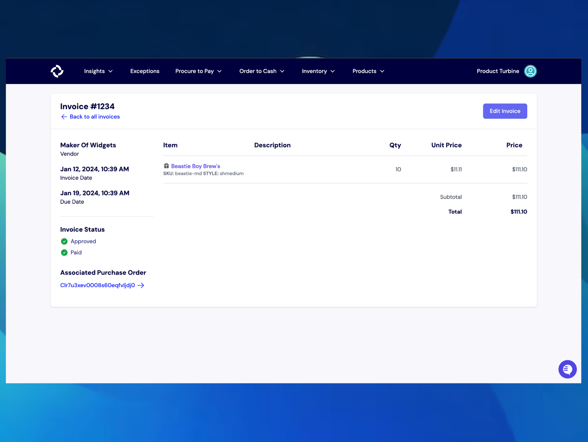

# Invoices
Invoices are the last part of the three-way match reconciliation process.

Invoices are sent from the manufacturer to the buyer, stating what goods were purchased, their cost, and the timeframe for payment.

## Creating an Invoice
Creating invoices in Turbine is quick and easy.

1. Start at the “Procure to Pay” tab in the navigation bar, then click “Invoices.”
2. On the Invoices page, click the “New Invoice” button in the top right corner.
3. Next, fill in the required information, such as the invoice number, vendor, invoice date/due date, and the approval and payment statuses. You can also input the relevant purchase order, if applicable.
4. Click “Create Invoice.”
5. To add line items to the Invoice, enter the price, quantity, Turbine SKU, and Node for each one. The SKU field is equipped with search, so you only have to remember the name of the item or your internal SKU code, and we’ll look up the Turbine SKU for you.
6. After you have added each line item, click “Finish”.

## Invoice Statuses
In Turbine, Invoices have two types of statuses: Payment Status and Approval Status. 

Paid statuses are Due, Overdue, and Paid. 

- **Due**: The invoice payment has not been submitted, and the payment date has not passed yet.
- **Overdue**: The invoice payment has not been submitted, and the payment date has passed.
- **Paid**: The invoice payment has been submitted.

Approved statuses are Approved and Pending.
- **Approved**: The invoice has been cleared for payment.
- **Pending**: The invoice has not been cleared for payment.

## Editing an Invoice
- To start, click the Edit Invoice button on the top right hand side of the screen.
- Once the button is clicked, pencil icons will appear on the far right-hand side of each line item. You can then edit the specific line items you would like to change.
     - Editable fields are quantity, SKU, and price.
- **Important: Invoices are only editable for 48 hours after the initial creation time/date.**

If you need further assistance, please reach out to your account manager.

