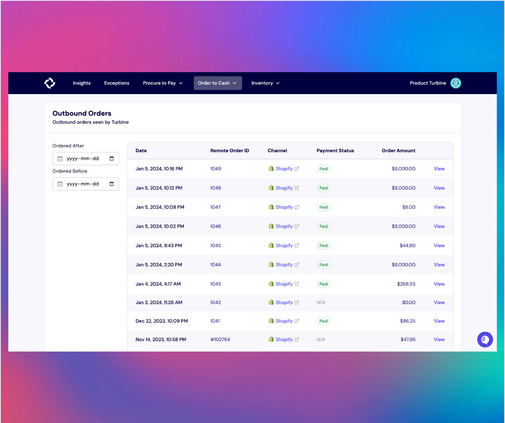
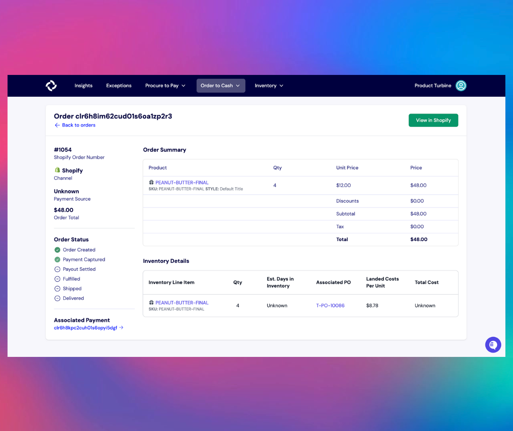
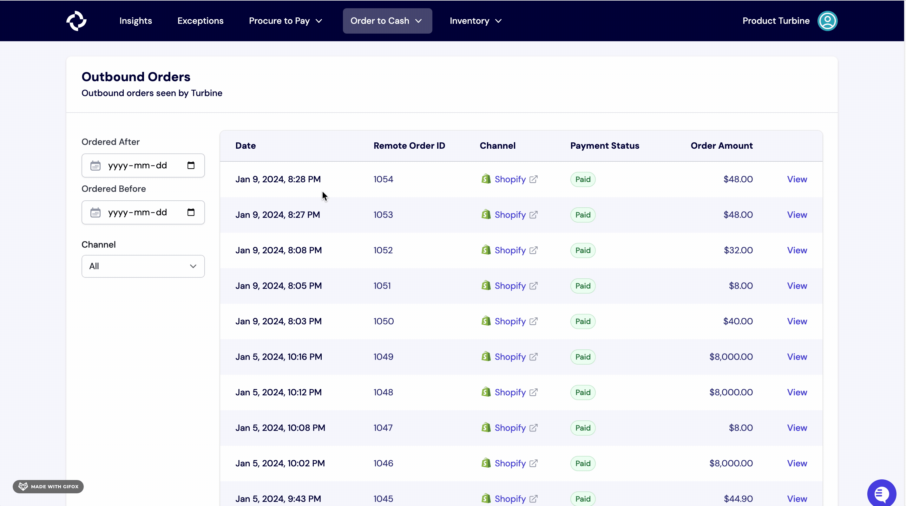
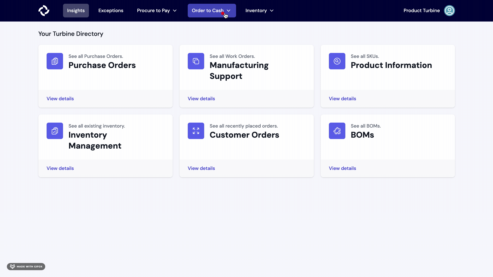

# Outbound Orders

Outbound orders are shipments that are fulfilled by you, either to an individual or to a wholesale buyer. 

On the Outbound Orders page, you can view the date and time that each order was placed, the sales channel of the order, the payment status, and the order total. You can also use the date picker on the sidebar to only display orders placed within a specific timeframe.

There are six possible statuses for an Outbound Order:

* **Order Created**: The order has been generated and entered into the system.
* **Payment Captured**: The payment has been successfully processed and completed.
* **Payout Settled**: Completion and resolution of any financial settlements or payouts.
* **Fulfilled**: The order has been successfully processed.
* **Shipped**: Items associated with the outbound order have been dispatched or sent out for delivery.
* **Delivered**: Ordered items have been successfully received.

Turbine integrates with several WMS systems including Veracore, Amazon FBA, Shipbob, and more. This allows you to see the fulfillment status of each order, its contents, and its payment status within the Order Details page.

## How to filter orders on Turbine

1. Navigate to the [Outbound Orders](https://app.helloturbine.com/app/outbound-orders) page.

2. On the left panel, locate the "Channel" button. Click on the button, and choose the specific channel you wish to apply as a filter.

## How to download Orders and Orders line items from the PO index screen 

1. Go to the [Orders index screen](https://app.helloturbine.com/app/outbound-orders).

2. Click on the download icon located at the top right corner of your screen.

3. Specify the export start date and export end date, then click the "Request Download" button. You will receive an email containing a link to download your data within the next 24 hours.

