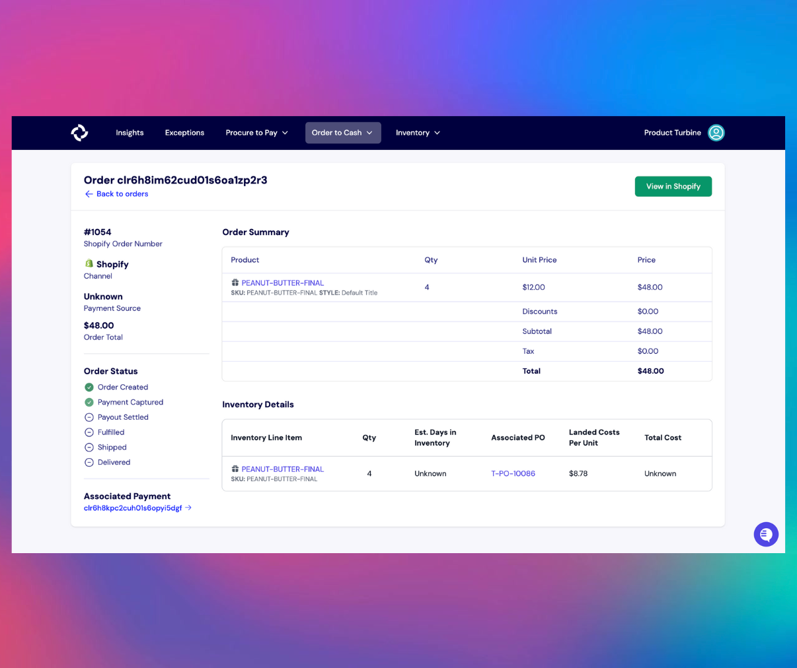

# Outbound Orders

Outbound orders are shipments that are fulfilled by you, either to an individual or to a wholesale buyer. 

On the Outbound Orders page, you can view the date and time that each order was placed, the sales channel of the order, the payment status, and the order total. You can also use the date picker on the sidebar to only display orders placed within a specific timeframe.

Payment statuses include:
**Pending**: The payment is awaiting processing.
**Paid**: The payment has been successfully processed and completed.
**Canceled**: A transaction has been intentionally ended before completion.
**Refunded**: A previously paid amount has been returned to the customer.
**Failed**: The payment attempt was unsuccessful. This could be due to reasons such as insufficient funds or technical issues.

Turbine integrates with several WMS systems including Veracore, Amazon FBA, Shipbob, and more. This allows you to see the fulfillment status of each order, its contents, and its payment status within the Order Details page.

