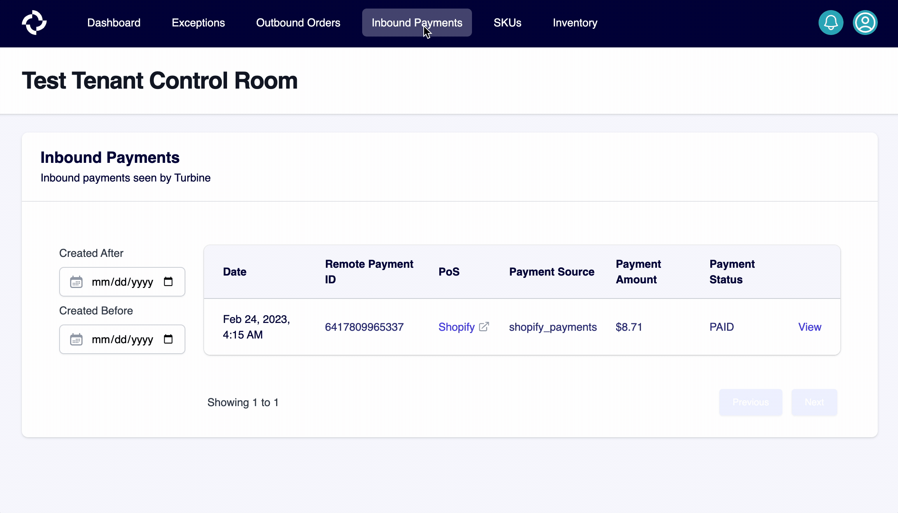

# Payments

Payments are individual transactions that debit a customer’s payment method and credit the your account on the payment provider (e.g., ShopPay, PayPal, AmazonPay, etc.). Payments go through four statuses in Shopify: Authorization, Capture, Clearing, and Funding. Payments likely also have a "failed" state (to be confirmed).

Payments are typically capture as part of the checkout process, but may not completed until an order has shipped.