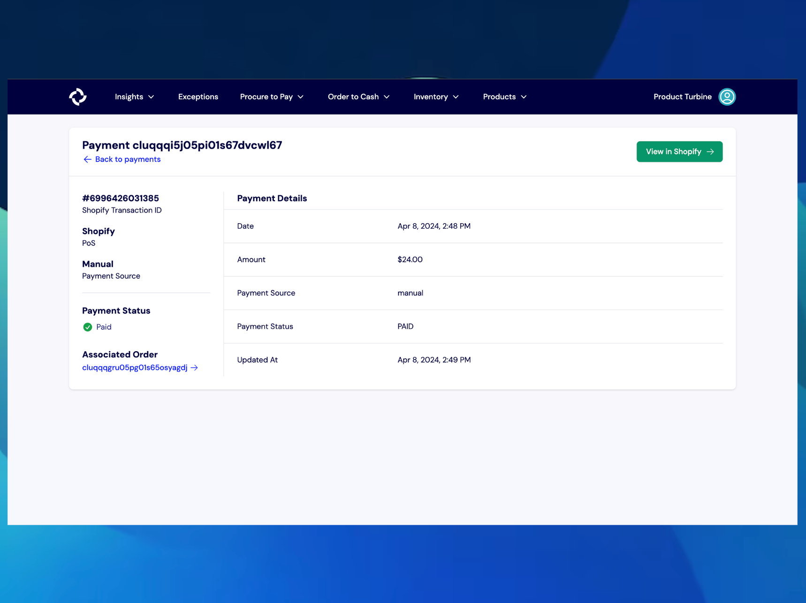
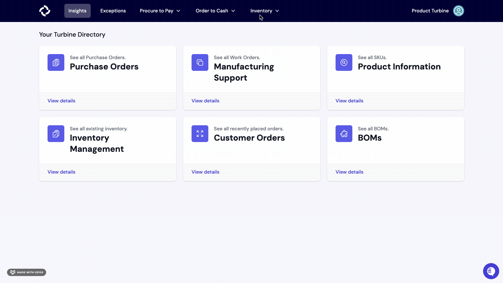

# Inbound Payments

Inbound Payments are individual transactions that debit a customer’s payment method and credit the account that you have with your payment provider. 

In the Inbound Payments tab under Order To Cash, you can view the status of each payment that has been attempted, the amount that was paid, and its source, such as PayPal. Additionally, you can also view the payment associated with each order on the details page of an outbound order.

There are five possible statuses for an Inbound Payment:
* **Pending**: The payment is awaiting processing.
* **Paid**: The payment has been successfully processed and completed.
* **Canceled**: A transaction has been intentionally ended before completion.
* **Refunded**: A previously paid amount has been returned to the customer.
* **Failed**: The payment attempt was unsuccessful. This could be due to reasons such as insufficient funds or technical issues.

Payments are typically captured as a part of the checkout process, but may not be completed until an order has shipped. If a payment isn’t captured for some reason, such as a credit card declining, we surface that to you in Turbine as an exception.

