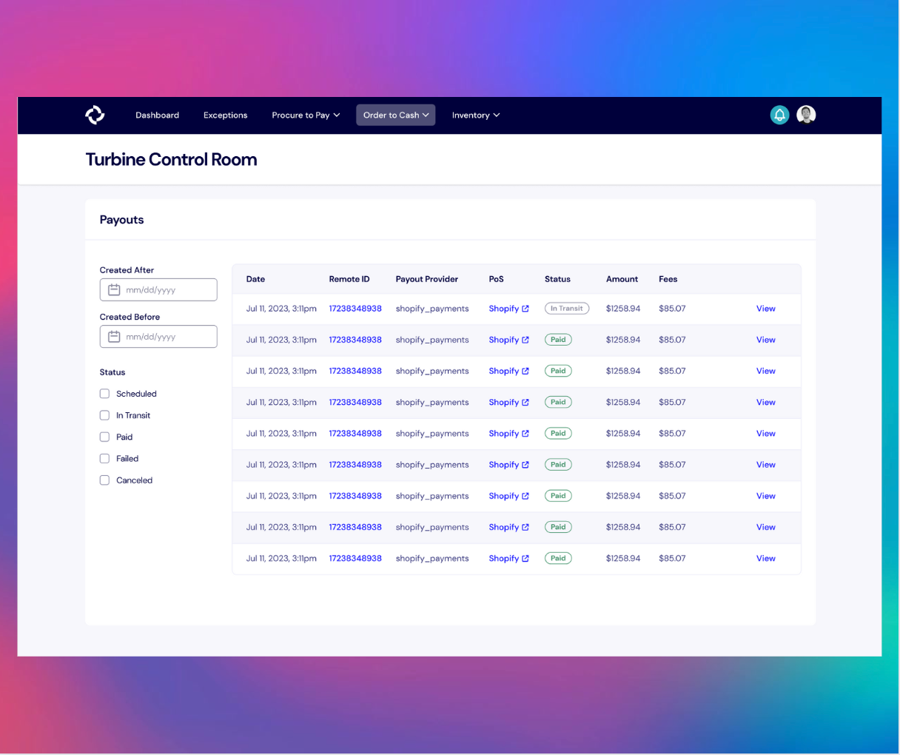
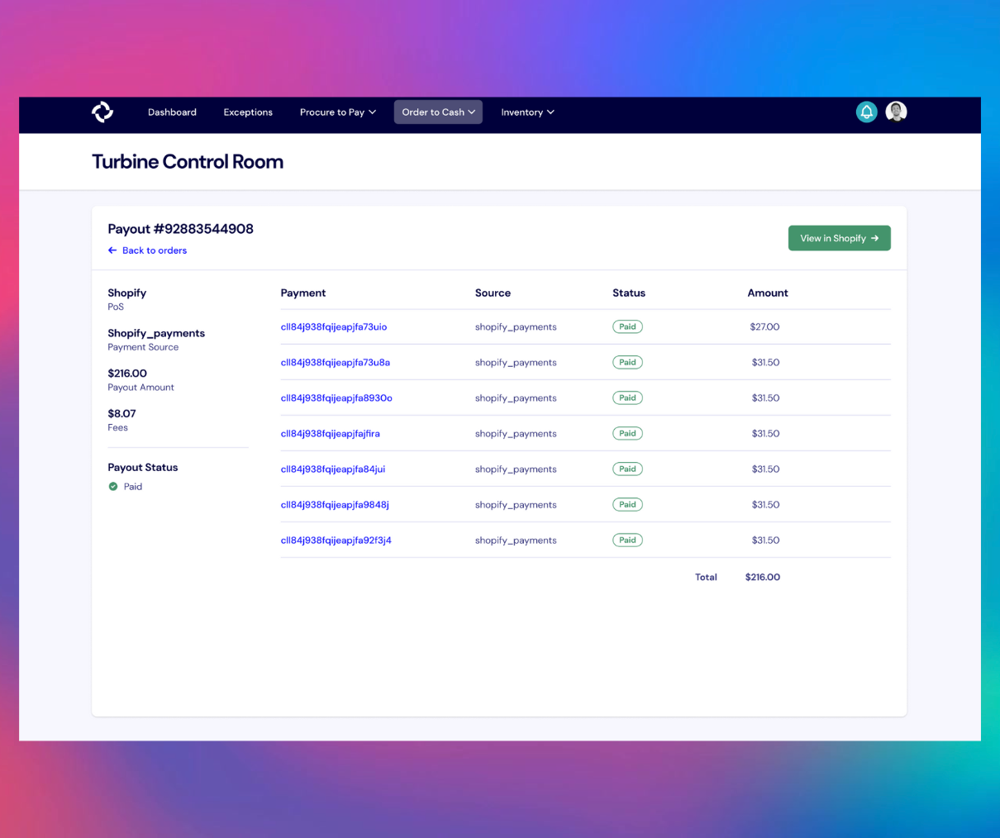

# Payouts

Payouts are the funds that are periodically disbursed from the payment processor of your sales channels to your company’s bank account.

In the payouts tab, you can view the provider of each payout, the sales channel where it originated from, its status, and the amount. You can also use the date picker on the sidebar to only display payouts received within a specific timeframe.

A payout can have 5 potential statuses:
* **Scheduled**: The payout is planned and is awaiting processing at a future date.
* **In Transit**: The payout is en route to your account but hasn't yet been completed.
* **Paid**: The payout has been successfully delivered to you.
* **Failed**: The payout attempt was unsuccessful. This could be due to issues such as incorrect account details.
* **Canceled**: The planned payout was intentionally ended before processing.

You can also view the individual payments that make up a particular payout on the Payout Details page.

