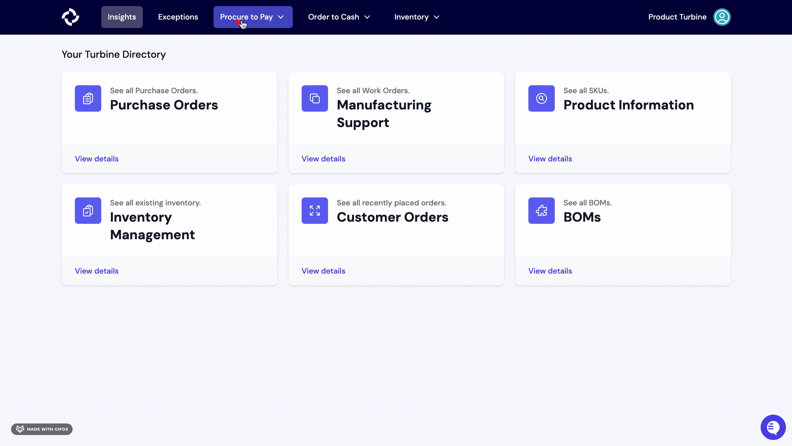
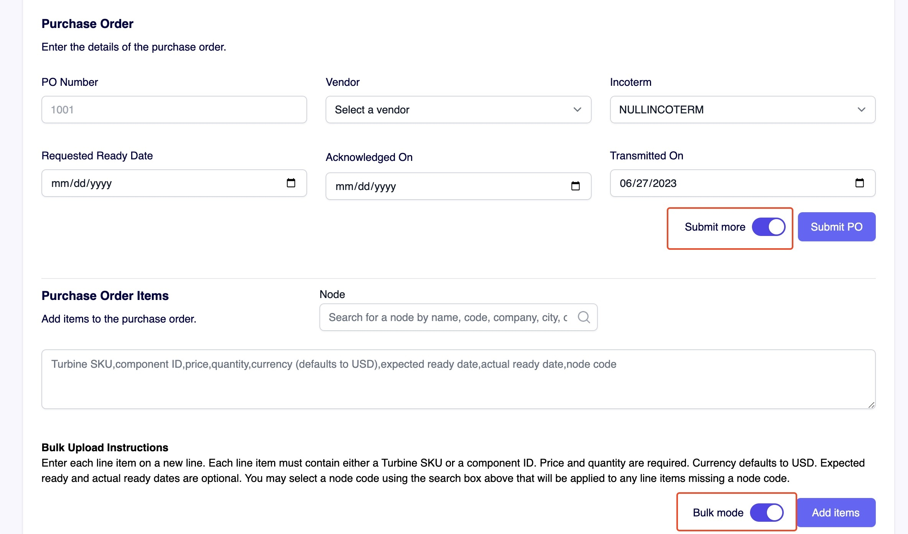
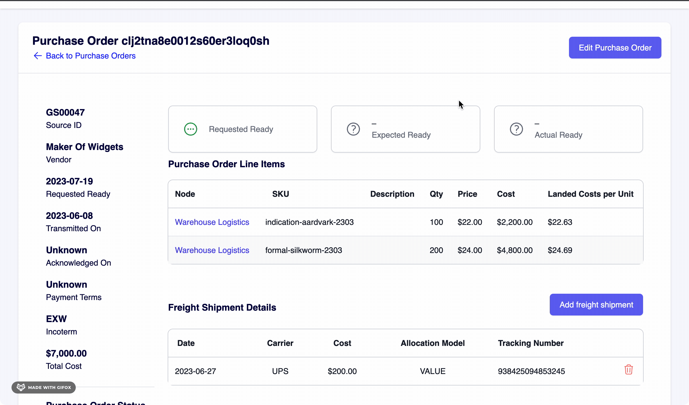
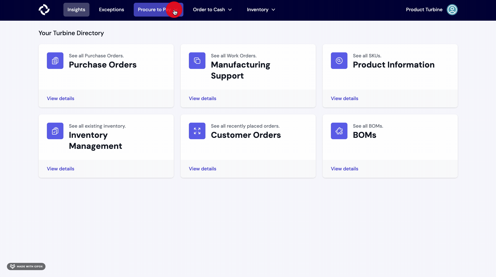
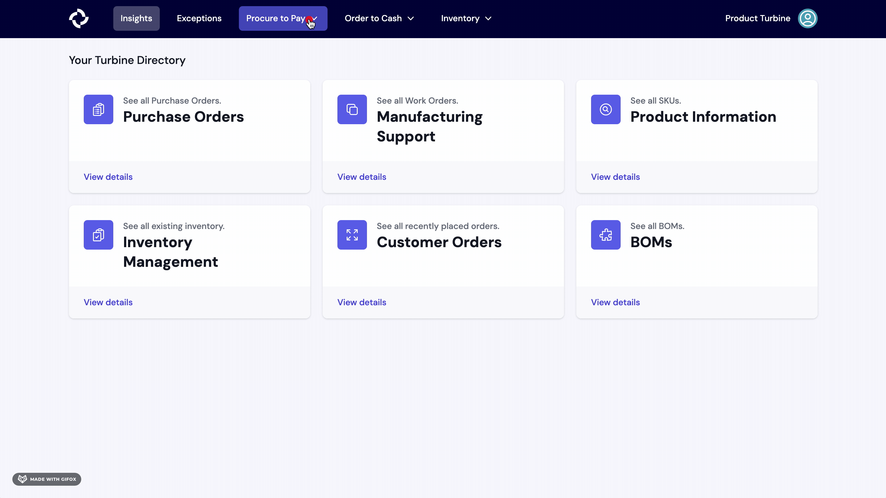
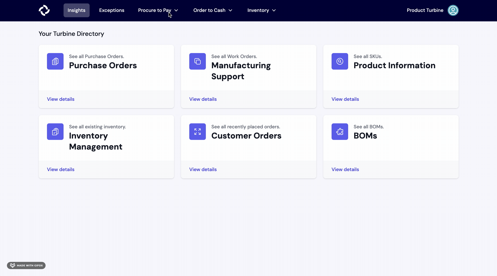
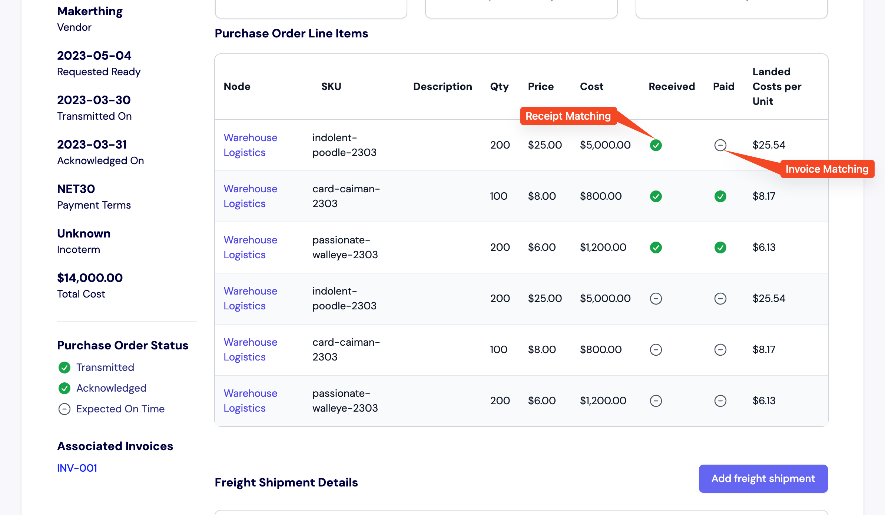

# Purchase Orders
Purchase orders, also referred to as POs, are the first part of the three-way match reconciliation process.

We help you cut purchase orders and link created POs to receipts, invoices, and freight shipments. We also calculate the landed COGS of each purchase order, so you don't have to rely on outdated models. 

If a discrepancy occurs, we'll raise an [exception](/exceptions/three-way-match) so any issues can be identified and dealt with quickly.

## Creating a Purchase Order

Creating a purchase order in Turbine is streamlined and simple.

1. Start at the “Procure to Pay” tab in the navigation bar, then click “Purchase Orders.”
2. Next, click the “New PO” button on the top right-hand side of your screen.
3. Fill out the relevant information, including the PO ID number, Vendor, any Incoterms, and the Requested Ready date. The Transmitted Date is automatically set to the day you create the Purchase Order, although this can be changed. If you do not have a piece of information on hand, you can always edit the PO later.
4. To add line items to the Purchase Order, enter the price (you can add up to 6 decimal places), quantity, Turbine SKU, and Node for each one. The SKU field is equipped with search, so you only have to remember the name of the item or your internal SKU code, and we’ll look up the Turbine SKU for you.
5. Hit the “Submit PO” button.
6. Once you are satisfied with your PO, in the upper right, hit the send icon to schedule your PO's send. By default, it will send in 10 minutes, though it can be scheduled up to 30 days in the future.

For large Purchase Orders, line items can be submitted in bulk by using the “Bulk Mode” toggle switch at the bottom of the screen and following the listed instructions.

You can also cut multiple Purchase Orders at once by using the “Submit More” toggle switch towards the top of the screen, in the Purchase Order Details section. 

A starter template for [the bulk upload of PO Line Items](https://docs.google.com/spreadsheets/d/1ZVSR8Ha0_WqmAbTv-eB9t4e1aw2ZRQJDi96ik6jT68A/edit#gid=1959592565) is available.

## Editing a Purchase Order

Important information such as the acknowledgment date and payment terms may not be readily available when creating a purchase order. Turbine allows you to easily edit POs to add this information later.

To start, click the "Edit PO" button in the top right corner of your screen. From there, you can add or modify important dates, Incoterms, and payment terms. Once you have made the necessary changes, remember to click "Save" below the Payment Terms field.

## Editing Line Items on a Purchase Order

Once a PO has been fully or partially received it is no longer editable, so a PO can only be edited until items have been completely received.

To the far right on a PO, you will see an Edit (pencil icon) or Delete (trash icon) button. 

When editing a line item, you'll see a pop out modal where you can make any changes. 

Changes will trigger a follow up email being added to send queue within 10 minutes.

## Adding New Line Items on an Existing Purchase Order

1. Select the "Add line item" button on the right of a PO.
2. Enter the price, quantity, Turbine SKU or component, and Node and hit the "Add" button.
   
Note that once a PO has been fully or partially received it is no longer editable, so a PO can only be edited until items have been completely received.

## How to add other charges to a PO 

1. Scroll to the bottom of a PO and select the "Add Charge" button.
   
2. Enter the Name, Charge, Type, and Allocation and hit the "Add" button.

## How to filter Purchase Orders by vendor on Turbine

1. Navigate to the [Purchase Orders](https://app.helloturbine.com/app/purchase-orders) page.

2. On the left panel, locate the "Vendor" button. Click on the button, and choose the vendor you wish to apply as a filter.

## How to download POs and PO line items from the PO index screen 

1. Go to the [PO index screen](https://app.helloturbine.com/app/purchase-orders).

2. Click on the download icon located at the top right corner of your screen, next to the "New PO" button.

3. Specify the export start date and export end date, then click the "Request Download" button. You will receive an email containing a link to download your data within the next 24 hours.

## Active vs Inactive Purchase Orders

Purchase Orders in Turbine are classified as either “active” or “inactive”. 

A PO is considered active if one or more line items have not been received. Inactive POs have been fully received, as indicated by a receipt.

Purchase orders can be filtered by date on the index page. 

## Purchase Orders and the Three Way Match
The Purchase Order is the central document in completing a [three-way match](https://www.helloturbine.com/blog/whats-three-way-match). 

At Turbine, we start from the Purchase Order and tie line items together across all three documents, so you can track an item from the first step in procurement to the last step in fulfillment. 

This data allows you to complete three-way match at a glance. Each line item on a PO contains an indicator that shows whether a line item has been received and if it has been paid for. 

Any issues are surfaced on the Exceptions page.

## Purchase Order FAQs

### How can I add size breaks in the PO?

For companies that have a parent SKU with many sizes to consider when creating purchase orders, each size must be added as an individual line item. This is important to Turbine's accurate costing analysis. 

You can add individual sizes to the line items via our UI. If order many line items, we recommend leveraging our [Bulk Upload](/records/purchase_orders#creating-a-purchase-order) method for cutting a PO. 

