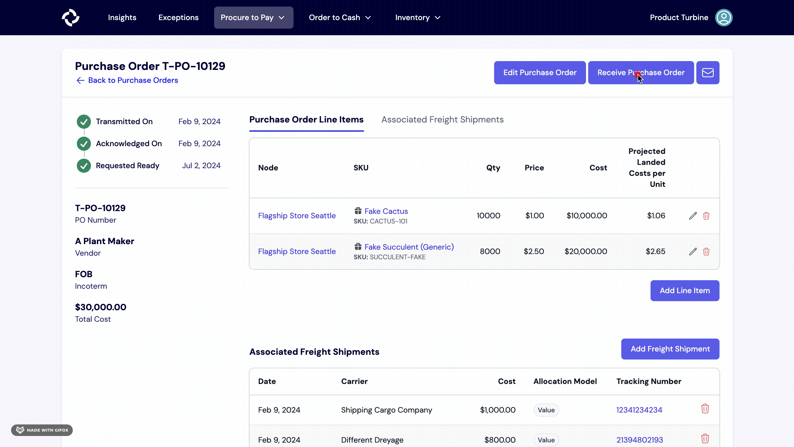

# Receipts
Receipts are the second part of the three-way match reconciliation process. 

After a [purchase order](/records/purchase_orders) has been completed and the goods have been delivered to their destination, a receipt is provided by the warehouse. 

Ideally, the items and quantities listed should be exactly the same as the purchase order. Sometimes, the production levels are off. Error tolerance levels are usually +/- 5% of what was originally ordered. 

In the event an error is greater than what you specify, we'll raise an [exception](/exceptions/three-way-match) so you can figure out what went wrong.

## Generating a Receipt from a PO

If your Purchase Orders typically arrive within one shipment, you can create a receipt directly from the Purchase Order screen by following these steps:

1. Navigate to the relevant Purchase Order by clicking on the “Procure to Pay” tab, then click on the Purchase Order that you would like to create a receipt for.
2. Next, click on “Receive Purchase Order” in the top right corner.
3. Fill out the relevant information, including the Receipt ID number, Vendor, Node (if applicable), the received date, and the Purchase Order ID.
4. To add line items to the Receipt, enter the quantity and Turbine SKU for each one. The SKU field is equipped with search, so you only have to remember the name of the item or your internal SKU code, and we’ll look up the Turbine SKU for you.
5. Once everything is filled out, hit the “Submit Receipt” button.

## Generating a Receipt from an Inventory Transfer

1. Navigate to the relevant Inventory Transfer by clicking on the “Procure to Pay” tab, then click on "Transfer" and select the one that you would like to create a receipt for.
2. Next, click on “Receive Transfer” in the top right corner.
3. Fill out the relevant information, including Vendor, Receipt Number, the received date, and the Quantity.
4. Once everything is filled out, hit the “Create Receipt” button.

## Generating a Receipt from a Work Order

1. Navigate to the relevant Work Order by clicking on the “Procure to Pay” tab, then click on "Work Order" and select the one that you would like to create a receipt for.
2. Next, click on “Receive Work Order” in the top right corner.
3. Fill out the relevant information, including Receipt Number, the received date, Lot number (if applicable), and the Quantity.
4. Once everything is filled out, hit the “Create Receipt” button.

## Linking Receipts to Nodes
For companies with multiple [nodes](/records/nodes), ensuring that inventory arrival is accurately marked at the appropriate location is essential.
When creating or uploading a receipt, you have the option to select the node where the shipment will be arriving. For warehouse users, node locations are automatically selected.

## Updates to Receipts

If a change to a receipt is made, we will only update inventory batch quantities received and remaining only if:
* we're within the 7 day edit window 
* if changing remaining quantity doesn't cause us to stock out or go negative (e.g. we already have orders attributed to this batch)

Changes made outside of the 7 day edit window do not propogate to inventory.
