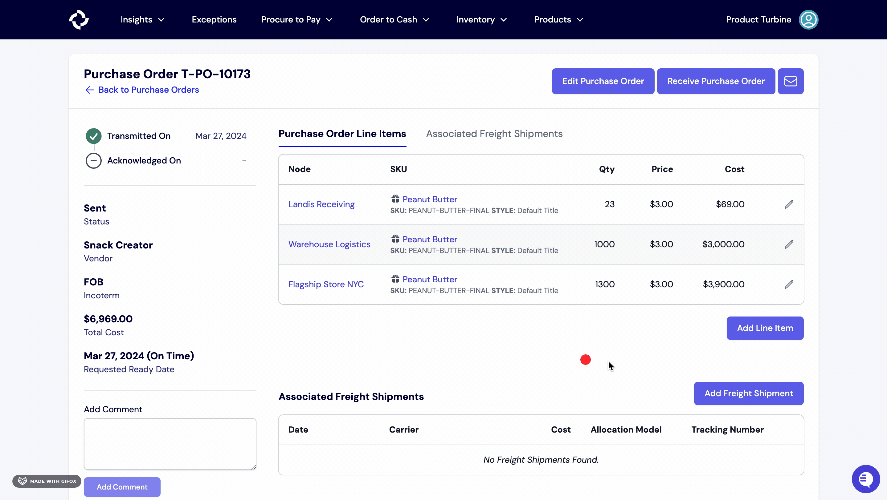

# Shipments
Shipments capture the movement of items between your vendors, and your nodes.

For inbound shipments, we link purchase orders with incoming deliveries. Sometimes POs get spread out over multiple shipments, or multiple POs are included in one shipment. This makes it difficult to determine when a purchase order has been fulfilled. With Turbine, you can keep track of what you have on hand and what's on the way. We also integrate with carriers such as UPS, C.H. Robinson, and others.

## Linking Shipments to Purchase Orders

Once tracking information is received from a carrier, you can link the shipment to a Purchase Order and calculate your landed costs.

1. Start by navigating to the Purchase Order you would like to add a shipment to. Click on the "Procure to Pay" tab in the navigation bar, then select "Purchase Orders," and choose the specific Purchase Order.

2. Scroll to the "Freight Shipment Details" section and click on the "Add Freight Shipment" button.

3. Enter the details of the shipment, including the carrier, tracking number, allocation method, and cost. Then, click "Save." The landed cost of each item will automatically populate. Landed costs can be calculated in three ways -- by value, by number of items, or by weight.

Saved shipments will also appear on the Freight Shipments page. If it is a supported carrier, we will verify the entered information with the carrier's systems to ensure the price and tracking information is accurate. If so, information such as the shipped date and expected delivery date will be populated on the Freight Shipments page.

## Matching, Verifying, and Deleting Tracking Numbers on Shipments

Freight shipments that have been linked to a Purchase Order show up on the Freight Shipments page. Each entry shows the carrier, tracking number, shipped date, expected delivery date, and actual delivery date. 

For supported carriers, Turbine verifies the tracking number as it is entered on the Purchase Order screen. Incorrect pricing or tracking numbers will not be saved. Instead, you will get a warning to check the entered info and try again.

For other carriers, the tracking number is turned into an external link that will bring you to the carrier's website, if applicable. If the tracking number is incorrect, the link will not work. To fix this, simply click the red trashcan icon to delete the freight shipment from the purchase order. Then, re-enter the information.

## Expected Arrival Date vs. Actual Arrival Date
Turbine distinguishes between the estimated arrival date of freight shipments and their actual arrival date, providing valuable insight into your on-time delivery percentage. The data gathered from this distinction serves several use cases, including optimizing inventory processes, evaluating the efficiency of your logistics process, and quickly identifying delays or supply chain disruptions. In cases where a delay is excessive, Turbine raises an exception, enabling you to adjust your plans accordingly. 

## Shipment Carrier Integrations
Turbine currently offers integrations with C.H. Robinson, Flexport, and Easypost. 

Freight shipments from those C. H. Robinson will auto-populate on your Shipments dashboard. 

When adding inbound shipments to purchase orders, tracking numbers 
belonging to USPS, UPS, DHL, and Fedex will go through data validation and be surfaced on the Shipments Page.

## Allocation Model

Freight shipments can be allocated to a PO by number of items or by the value of those items. 
For example, say you have PO #1234 with the following line items:
100 of SKU 123 at $10 each
50 of SKU 456 at $20 each

If you allocate your $1000 of shipping cost by number of items:

| SKU     | Quantity | Price per Unit | Shipping per Unit | Landed costs |
|---------|----------|----------------|----------|--------------|
| SKU 123 | 100      | 10             | 6.66     |  16.67       |
| SKU 456 | 50       | 20             | 6.66     |  26.67       |
|         |          |                |          |              |

Total cost 

If you allocate your $1000 of shipping cost by value of items:

| SKU     | Quantity | Price per Unit | Shipping per Unit | Landed costs |
|---------|----------|----------------|----------|--------------|
| SKU 123 | 100      | 10             | 5        |  15          |
| SKU 456 | 50       | 20             | 10       |  30          |
|         |          |                |          |              |

One allocation model is not superior to the other. The best allocation model for your business is a business decision. 
