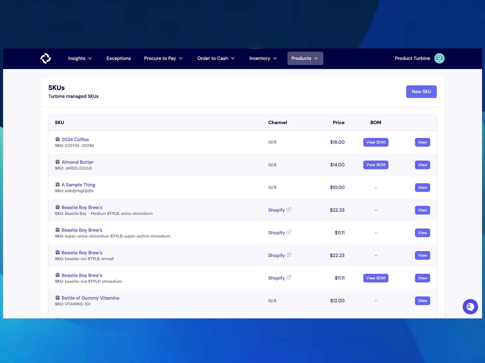
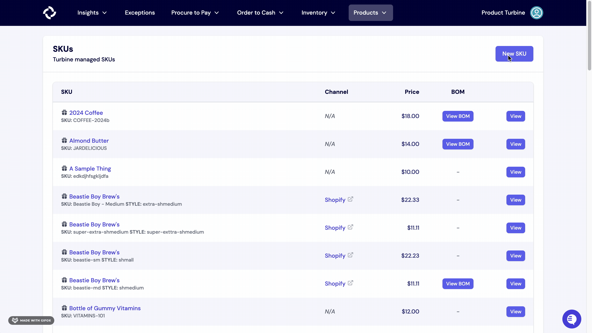

# SKUs

Stock keeping units, informally known as SKUs, are codes used to keep track of individual inventory units and components. There are four main types of SKUs that Turbine uses to keep track of inventory and cut purchase orders:

**Vendor SKU**: The identifier that your supplier (or vendor) uses to identify a particular item.

**Internal/Remote SKU**: The identifier that you use internally to identify an item.

**Channel SKU**: The identifier that a particular sales channel uses to identify an item (e.g. Shopify’s Variant ID)

**Turbine SKU**: The ID that Turbine uses to tie all the different channels and vendor identifiers together. 

Turbine SKUs are created at a variant level, meaning that each Turbine SKU is mapped to a unique product. For example, an apparel company might sell a white T-shirt in sizes XS-XL. In Turbine, each of those products would have a unique Turbine SKU.

## Creating a SKU in Turbine

1. Go to "Products" in the navigation bar and select “SKUs”.
2. Next, select "New SKU" button at the top right-hand side of your screen.
3. Fill out the relevant information, including SKU title, SKU, and final price of the SKU.
4. Hit the "Create SKU" button.
5. If available, you can add other info such as barcode value.

## Editing a Remote SKU

A remote SKU can only be edited on the SKU details page. After navigating to the SKU details page, select "Edit". A modal will pop up with a text box that can be edited. You change will permeate through the app upon saving. 

## How to archive a SKU in Turbine

1. Go to the [SKUs](https://app.helloturbine.com/app/skus) Page.
2. Next, select the SKU you want to archive.
3. Alternatively, you can bang search by typing CMD+K or CTRL+K and !s and type the SKU you want to archive.
4. Hit the “Archive” button at the top right-hand side of your screen.

## How to add a barcode to a SKU 

1. Go to the [SKUs](https://app.helloturbine.com/app/skus) Page.
2. Next, select the SKU you want to add a barcode to.
3. Alternatively, you can bang search by typing CMD+K or CTRL+K and !s and type the SKU you're looking for.
4. On the left-side of your screen you see Barcode with an "Edit" button. Click on the "Edit" button and type the barcode value.
5. Hit the "update" button.

## How to find the Shopify Product ID and Variant ID of a SKU 

There are two methods to find the Shopify Product and Variant IDs of a SKU.

**Method 1**: SKU Details Screen:
* Navigate to the SKU details screen.
* Below the Remote SKU information, you will find both the Shopify product and variant IDs.

**Method 2**: Channels for this SKU:
* On the SKU details page, scroll down to "Channels for this SKU."
* Right-click the Shopify link, copy the URL.
* Paste the URL into a blank page.
* This will enable you to identify both the Shopify product and variant IDs associated with the SKU from the URL.

## SKU Details

On our SKU details screen you can see a number of key pieces of information about a SKU, including: 
* BOM
* Internal/Remote SKU
* Price (What you sell it for)
* Landed Cost (What you buy it and get it to your warehouse for)
* Barcode, if you're tracking one
* Channels where you're buying an item
* Vendors where you're sourcing an item
* Landed costs over time
* Related POs (both opened and closed)

### Related Purchase Orders

There are two types of Purchase Orders: Open Purchase Orders and Closed Purchase Orders.

* Open Purchase Orders: These are purchase orders where line items have not been received.
* Closed Purchase Orders: These are purchase orders where all line items have been received.

Details for Purchase Orders include:

* **Transmitted At**: The timestamp or date when the purchase order was transmitted.
* **PO Number**: An identifier representing the purchase order.
* **Vendor**: The name or identification of the supplier or vendor associated with the purchase order.
* **Quantity of SKU**: The number of units or quantity of the specified SKU within the purchase order.

