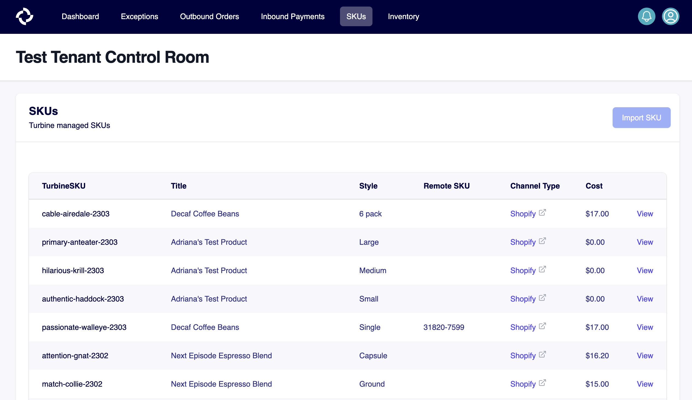

# SKUs

*TurbineSKUs* are items that Turbine knows about. TurbineSKUs are at a "Variant" level, meaning that you will have one TurbineSKU for each unique style/shade combination of a product. For an apparel company, a blue XL sweatshirt, a red XL sweatshirt, and a red L sweatshirt would each be a unique TurbineSKU.

A single TurbineSKU can be linked to multiple sales channels via a _ChannelSKU_. This is the SKU as it appears in the sales channel's system (e.g., a Shopify _Variant ID_). This allows Turbine to track sales and inventory across all of your partners in one system

A single TurbineSKU can also be linked to multiple vendors via a _VendorSKU_. This the SKU as it appears in the vendor's system. This allows Turbine to track purchase orders and incoming inventory for a single TurbineSKU across multiple vendors.