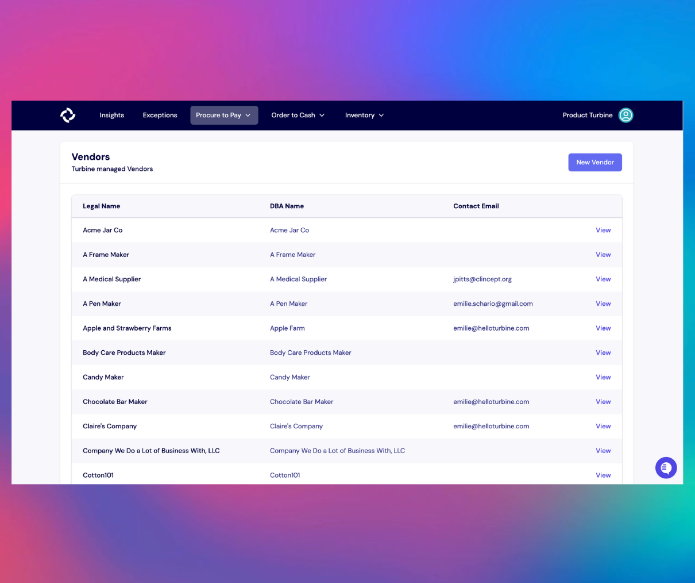

# Vendors

In Turbine, vendors or suppliers are critical entities that supply goods or services to businesses. They are registered on the platform with detailed information including their legal and "Doing Business As" (DBA) names, which help in distinguishing and authenticating various vendors. Additionally, Turbine collects contact details of individuals handling operations and Purchase Orders (POs), facilitating seamless communication and transaction management.

To streamline inventory management and avoid discrepancies, Turbine allows you to map your internal SKUs and components to the respective Vendor SKUs. This ensures a unified system where products are identified uniformly, irrespective of the varied nomenclatures used by different vendors. This not only helps in maintaining a structured database but also aids in efficient procurement processes, fostering a harmonious business relationship between companies and their vendors or suppliers.

To access all Purchase Orders associated with a specific vendor, simply scroll to the bottom of the Vendors screen. This provides a convenient flow for you to retrieve relevant information and enhances the overall usability of the Turbine platform.

## Add a Vendor to Turbine

1. From the [Vendors](https://app.helloturbine.com/app/vendors) Page in the upper right, select "New Vendor". 

2. In the "Create Vendor" modal, add the DBA (Doing Business As) & Legal Name for the vendor, as well as the default Incoterm that you use with that vendor. If you are not tracking Incoterms with the vendor, use the "NULLINCOTERM" option.

3. Add additional details, including contact, email addresses, and an address to the vendor. Hit "Update Vendor" save changes. 

## Add a SKU to the Vendor 

Many times, your supplier uses a specific term or code to refer to an item. We call that the [Vendor SKU](https://docs.helloturbine.com/records/skus). You may have head it called a "Manufacturer Code" or similar. 

To add a SKU to a Vendor, you'll need:
* the Remote SKU
* the Vendor SKU
* the Lead Time for the SKU
* the cost of that unit from your supplier

The Lead Time should factor in travel time _and_ manufacturing time.

## Edit a Vendor

To edit a vendor, go to the Vendor details screen and make any changes. Make sure to SAVE changes. 

## How to archive a Vendor in Turbine

1. Go to the [Vendors](https://app.helloturbine.com/app/vendors) Page.
2. Next, select the Vendor you want to archive.
3. Hit the “Archive” button at the top right-hand side of your screen.
