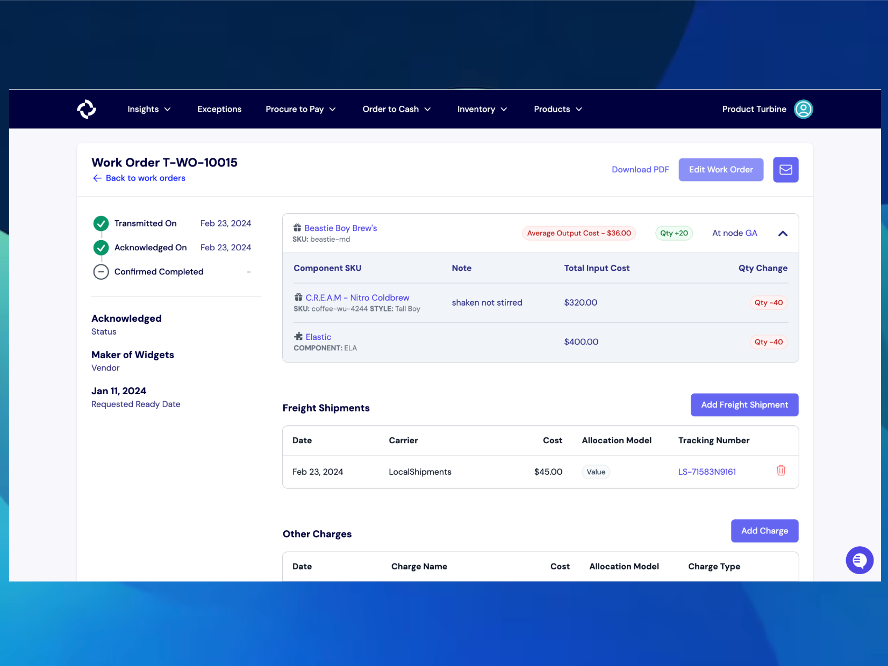
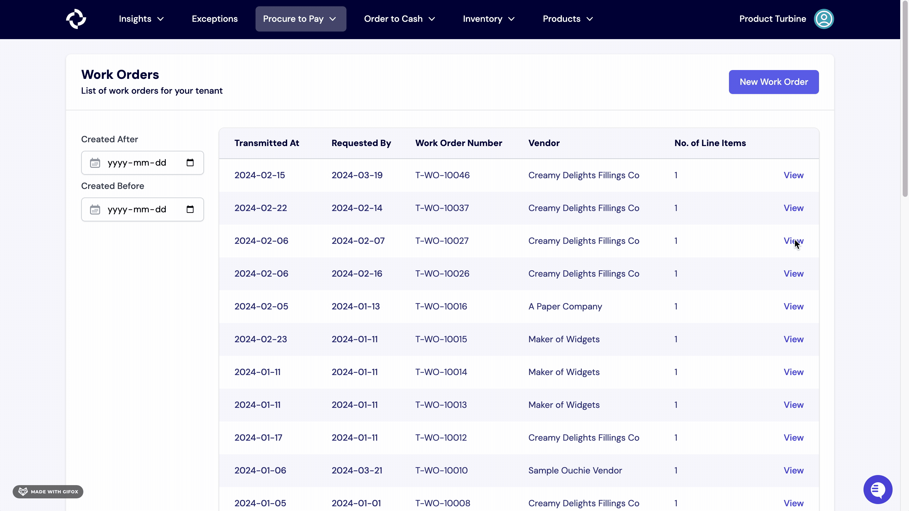
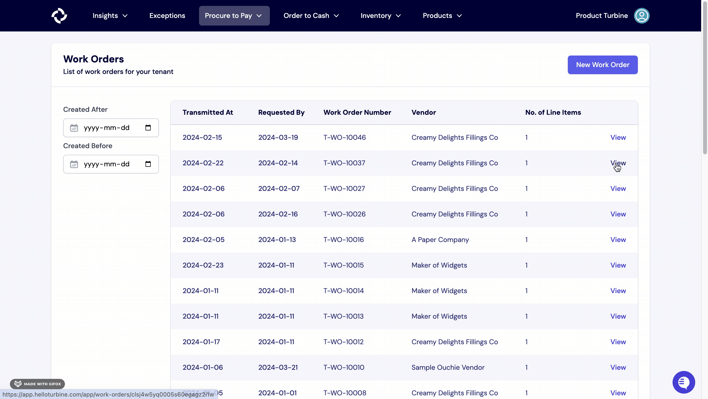
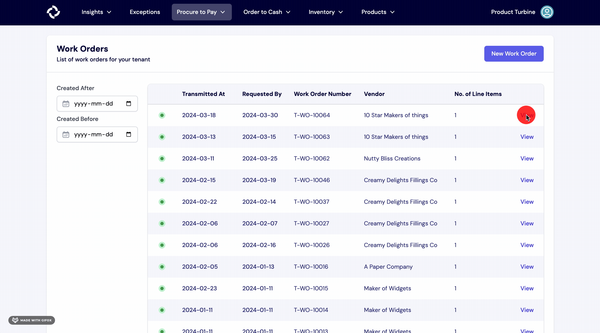

# Work Orders

For brands that perform their own manufacturing or use a co-man, work orders can be a useful tool to track the creation of new inventory and the consumption of components. Once a work order is run, the changes to inventory will be reflected on the Stock page. 

On the details page of a Work Order, within the left panel, you can view the requested ready date, the vendor, and the status of the Work Order.

There are six possible statuses for a Work Order:

* **Created**: The Work Order has been created.
* **Sent**: The Work Order has been successfully sent.
* **Acknowledged**: The Work Order has been acknowledged by the relevant parties.
* **Completed**: The supplier has confirmed completion of the Work Order.
* **Closed**: All line items associated with the Work Order have been fully received.
* **Cancelled**: The Work Order has been cancelled.

## Creating a Work Order

To create a work order, follow these steps:
1. Start at the “Procure to Pay” tab in the navigation bar, then click “Work Orders.”
2. Next, click the “New Work Order” button on the top right-hand side of your screen.
3. Fill out the relevant information, including the Vendor, the Requested Ready date, the Transmitted On date, and the Node where the manufacturing will take place. Please note that only Vendors who are manufacturers will be available for selection. The day before the Requested Ready Date, the manufacturer will receive an email to confirm the completion status.
4. To add line items to the Work Order, enter the quantity and Turbine SKU for each one. Please note that SKUs need to be assigned to the Vendor as a Vendor SKU to facilitate the Work Order creation. The SKU field is equipped with search, so you only have to remember the name of the item or your internal SKU code, and we’ll look up the Turbine SKU for you.
5. Once everything is filled out, hit the “Run Work Order” button. The proposed changes to inventory are **permanent**, so ensure that all details are correct before confirming.

Note: Work order line items must have an associated BOM before beginning this process. 

## How to add a Freight Shipment to a Work Order

1. Once a Work Order has been cut, select the "Add Freight Shipment" button on the right side of your screen.

2. Enter the Carrier, Cost, Allocation Model, and Tracking Number and hit the "Add" button.

## How to add other charges to a Work Order

1. Select the "Add Charge" button on the right of a work order.
   
2. Enter the Name, Charge, Type, and Allocation and hit the "Add" button.

## How to download a PDF for a Work Order

Once a work order has been cut, you can select “Download PDF” in the upper right.
It has all the details of the work order, including the items that are in the work order and the relevant BOMs. If there are multiple items, the BOMs for each item will be shown. 

## How to send a Work Order

Once a work order has been cut, select the mail icon in the top right-side of your screen. 
Fill out the relevant information, including when you want to email the work order, at what time, and the email of the recepient (if the email is already not configured at the Vendor). Please note that you will automatically be included in the CC line.
Hit the "Schedule Email" button. 

## How to receive a Work Order in Turbine

1. Navigate to the relevant Work Order by clicking on the “Procure to Pay” tab, then click on the Work Order that you would like to create a receipt for.
2. Next, click on the “Receive Work Order” button in the top right corner.
3. Enter the Receipt Number, Received Date, Lot (optional), and Quantity.
4. Hit the “Create Receipt” button.

