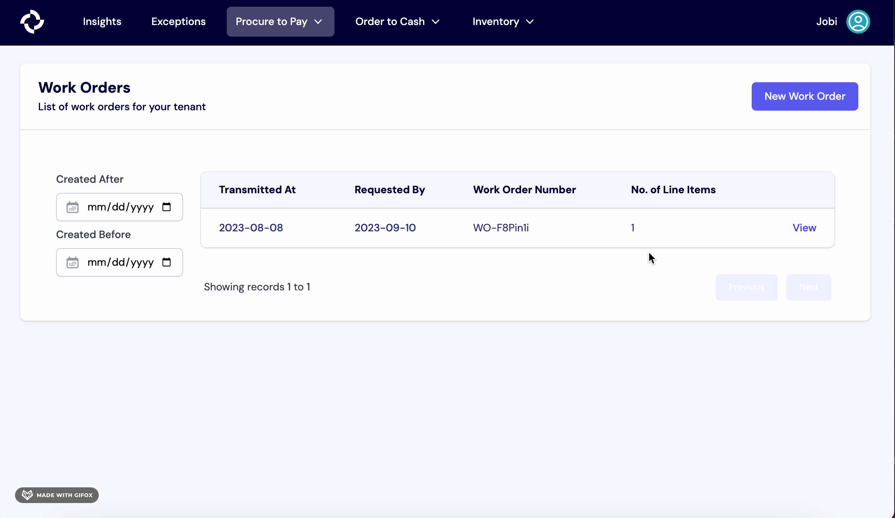

# Work Orders

For brands that perform their own manufacturing or use a co-man, work orders can be a useful tool to track the creation of new inventory and the consumption of components. Once a work order is run, the changes to inventory will be reflected on the Stock page. 

To create a work order, follow these steps:
1. Start at the “Procure to Pay” tab in the navigation bar, then click “Work Orders.”
2. Next, click the “New Work Order” button on the top right-hand side of your screen.
3. Fill out the relevant information, including the Requested Ready date, the Transmitted On date, and the Node where the manufacturing will take place.
4. To add line items to the Work Order, enter the quantity and Turbine SKU for each one. The SKU field is equipped with search, so you only have to remember the name of the item or your internal SKU code, and we’ll look up the Turbine SKU for you.
5. Once everything is filled out, hit the “Run Work Order” button. The proposed changes to inventory are **permanent**, so ensure that all details are correct before confirming.

Note: Work order line items must have an associated BOM before beginning this process. 

